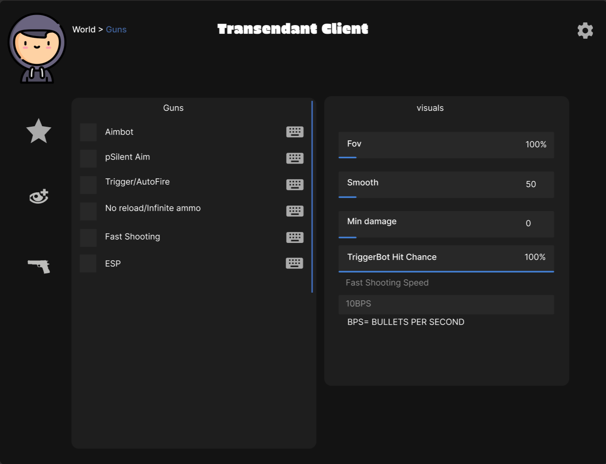
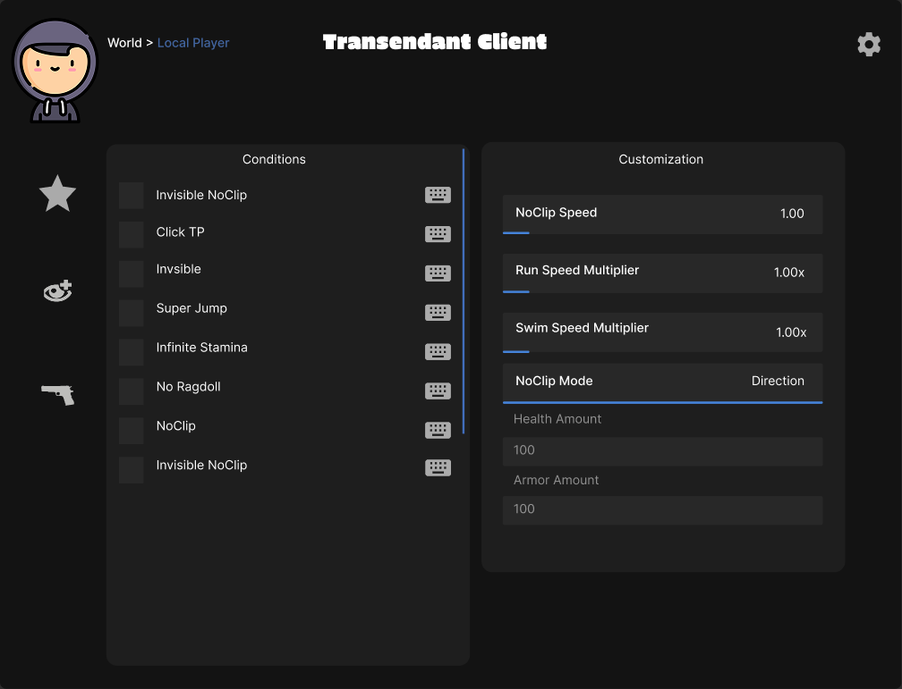

# Transendant Client  
> *Advanced Control Framework for Counter-Strike: Global Offensive*  

---

### 🧩 About  
Transendant Client is an extensible toolset built for manipulation and real‑time control of in‑game player and world parameters.  
Engineered for testing input handling, entity physics, and behavioral logic in controlled environments.

---

### ⚙️ Feature Overview  

**🎯 Combat Systems**  
- Aimbot & pSilent Aim modules  
- Trigger / AutoFire logic  
- No Reload & Infinite Ammo modifiers  
- Fast Shooting + Rate Tuning  
- Visual ESP suite with adjustable FOV, smoothing, and min damage  

**🌍 World & Environment**  
- Local Player entity live editing  
- Gravity, stamina, jump height & environmental overrides  
- “Conditions” module for contextual world states  
- Infinite Stamina toggle  
- No Ragdoll configuration  
- Super Jump parameterization  

**🚀 Mobility Layer**  
- NoClip (standard & invisible modes)  
- Click‑to‑Teleport with directional offset control  
- Adjustable NoClip Speed with full direction vectoring  
- Run & Swim Speed Multipliers (1.00x –∞ scale)  

**🧠 Player Attributes**  
- Health Amount override (0–1000)  
- Armor Amount override (0–1000)  
- Configurable stamina drain curve  
- Directional movement control logic  

**🎨 Customization**  
- Per‑module color schemes & layout persistence  
- Dynamic ImGui‑based UI with modular window states  
- Configurable quickbinds & profile export  

---

### 💾 Tech Base  
- C++ backend  
- ImGui overlay  
- Hooked memory offsets via custom signatures  
- Modular threading for rendering + event polling  

---

### 🧬 Intent  
Built to analyze, manipulate, and test how game state responds to unconventional variable inputs.
An engine for digital mischief disguised as “research.”  

---

### 🗺️ Roadmap  
- [ ] Lua scripting support  
- [ ] Cloud‑synced configs  
- [ ] Skin / visual asset injector  
- [ ] Lightweight anti‑trace deployment  

---
### 🗺️ GUI

